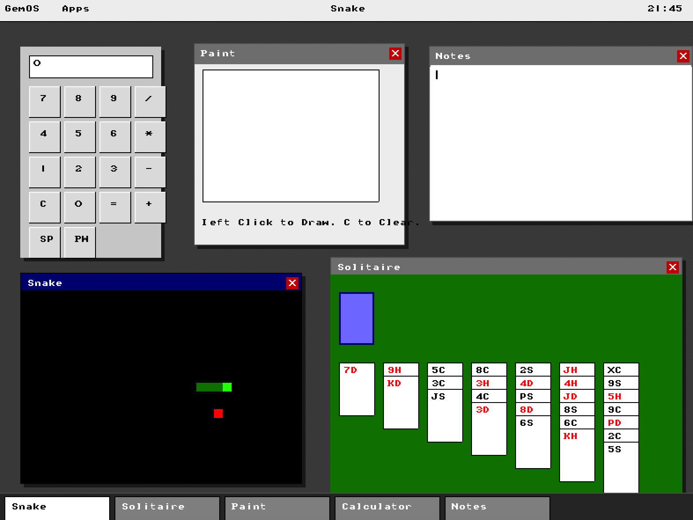

# GemOS

**GemOS** is a research operating system designed to explore the symbiosis between the kernel, the graphical shell, and the application runtime. Built from scratch in C and Assembly, it implements a vertically integrated stack where the OS provides not just system calls, but a high-level, declarative application language (**Gem**) as a native primitive.

 

## Project Philosophy

Modern operating systems often rely on massive, complex stacks of libraries to render user interfaces (e.g., X11, Wayland, Qt, GTK, Electron). GemOS takes a different approach: **What if the OS kernel understood the UI?**

By integrating the UI composition and application logic interpreter directly into the core, GemOS aims to achieve:
1.  **Extreme Simplicity:** Removing layers of abstraction.
2.  **Consistency:** Every application looks and behaves correctly by definition.
3.  **Safety:** Applications are high-level scripts that cannot corrupt kernel memory.

## Architecture

*   **GemCore:** The monolithic kernel (x86) handling interrupts, memory, and VESA graphics.
*   **GemShell:** The desktop environment/compositor, tightly coupled to the kernel.
*   **Gem (Language):** A declarative, state-driven language for building applications (inspired by SwiftUI).

See [docs/architecture.md](docs/architecture.md) for details.

## Current Status

**Status:** Experimental / Pre-Alpha.

*   ✅ **Bootable:** Custom bootloader works on QEMU x86.
*   ✅ **Graphics:** High-resolution VESA modes supported.
*   ✅ **Input:** Mouse and Keyboard interrupt drivers fully functional.
*   ✅ **Runtime:** Initial version of GemLang interpreter working.
*   ⚠️ **General Use:** Not ready for real hardware usage (no networking/sound).

## Getting Started

GemOS is designed to be built and run on macOS/Linux environments using cross-compilers.

### Prerequisites
*   `nasm` (Assembler)
*   `i386-elf-gcc` (Cross-compiler)
*   `qemu-system-i386` (Emulator)

### Building
```bash
./build.sh
```

### Running
```bash
qemu-system-i386 -drive format=raw,file=build/os.img
```

## Documentation

Comprehensive documentation is available in the `docs/` directory:
*   [Overview](docs/overview.md) - What is GemOS?
*   [Architecture](docs/architecture.md) - How it works.
*   [GemLang Specification](docs/gemlang.md) - Writing apps for GemOS.
*   [Design Philosophy](docs/design-philosophy.md) - Why it looks like this.
*   [Roadmap](docs/roadmap.md) - Future plans.

## Licensing

*   **GemCore & GemShell (The System):** GPLv2.
*   **GemLang & SDK (The Ecosystem):** MIT License.

## Collaboration with AI

This project leverages modern Large Language Models (LLMs) as key engineering assistants. AI is used throughout the development process for:
*   Refining C syntax and debugging kernel panic states.
*   Drafting driver implementations (VESA/PS2).
*   Iterating on the GemLang language specification.

This repository represents a curated, human-directed, and AI-accelerated engineering effort.

---
*Created by Maksu. Hosted on GitHub.*
