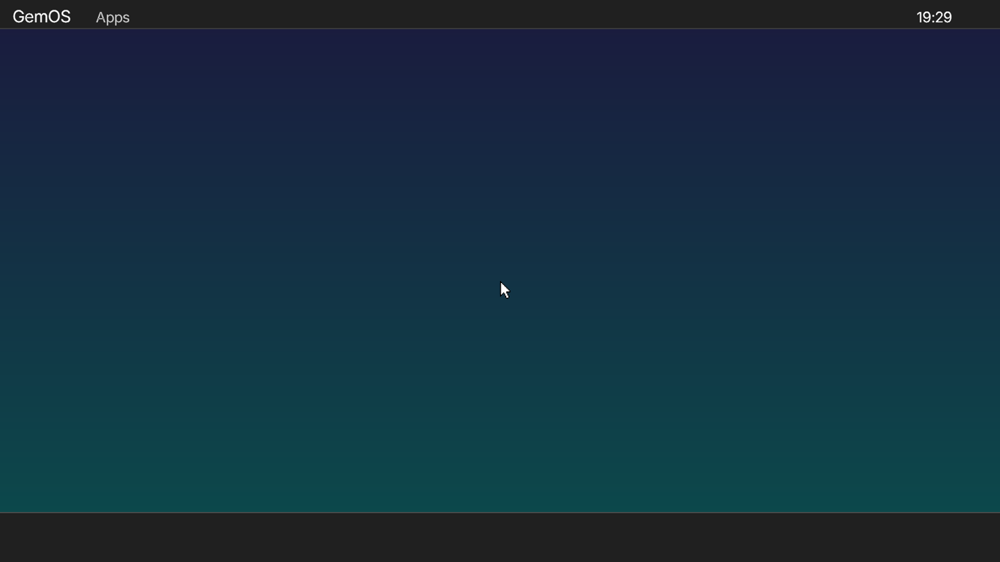
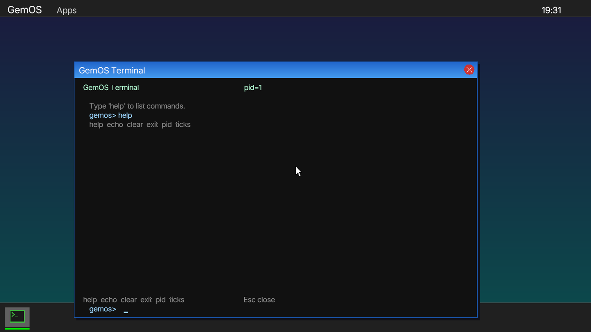
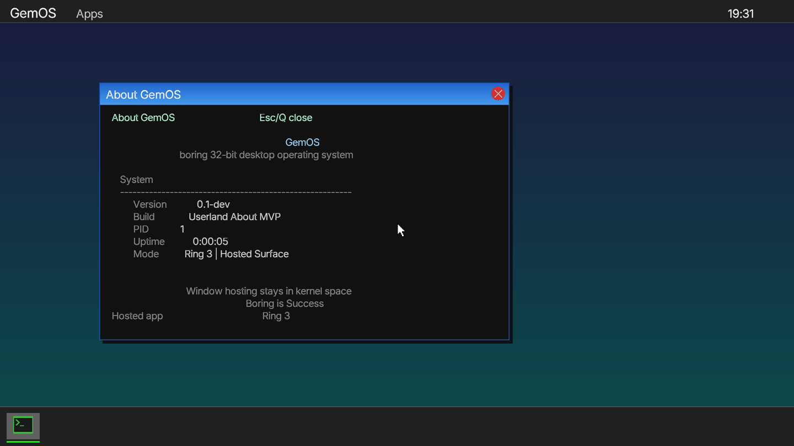
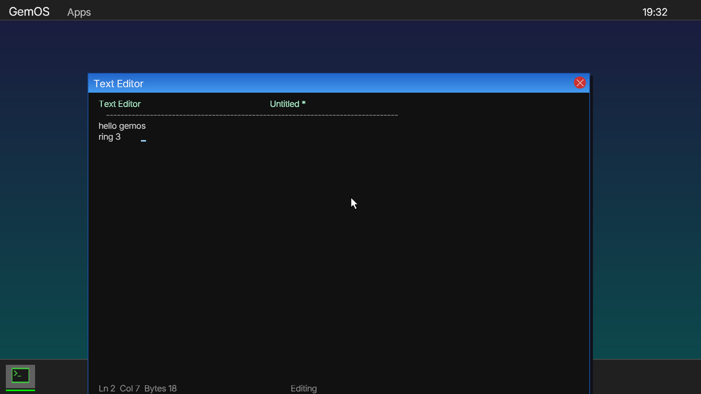

# GemOS

From-scratch 32-bit desktop operating system for x86, written in C and assembly.

[Project site]([https://maksu2.github.io/GemOS/](http://gemos.maksu.online)) • [Wiki](https://github.com/Maksu2/GemOS/wiki) • [Repository](https://github.com/Maksu2/GemOS)

<p align="center">
  
</p>

<table>
  <tr>
    <td></td>
    <td></td>
    <td></td>
  </tr>
  <tr>
    <td><strong>UTERM.ELF</strong><br>Hosted userland terminal</td>
    <td><strong>ABOUT.ELF</strong><br>Small informational userland app</td>
    <td><strong>UTEXTEDIT.ELF</strong><br>Userland text editor in active bring-up</td>
  </tr>
</table>

GemOS is a classic desktop-style operating system built end-to-end: bootloader, protected-mode bring-up, kernel, memory management, interrupt path, graphics stack, filesystem, scheduler, Ring 3 transition and now practical userland applications.

The project goal is not novelty for its own sake. The goal is to build a calm, coherent, technically honest system where architecture comes first and big rewrites are earned, not assumed.

## Why this project matters

- It owns the whole path from the boot sector to the desktop.
- It treats “boring is success” as an engineering rule, not a slogan.
- It is already past the fake userland stage: isolated Ring 3 processes run real apps while the desktop remains stable.

## What works now

### Boot and kernel foundations

- 2-stage bootloader
- A20, protected mode, kernel entry
- kernel-owned GDT for ring 0 / ring 3
- TSS, `ltr`, and `esp0` stack switching
- IDT, ISR / IRQ handling, PIC remap, PIT, RTC
- serial debug path

### Memory and execution

- heap allocator
- 32-bit legacy paging with 4 KB pages
- separate `CR3` per process
- shared supervisor-only kernel mapping as the transition model
- preemptive round-robin scheduler
- `process_t` / `task_t` split
- faulted user processes are killed without panicking the whole kernel

### Desktop, drivers and storage

- VBE LFB graphics
- page-flipped rendering path
- PS/2 keyboard and mouse
- TrueType font rendering
- window manager
- topbar, dock, menus and focus model
- ATA PIO
- GemFS

### Userland transition

- Ring 3 (`CPL=3`)
- ELF32 static `ET_EXEC` loader
- `int 0x80` syscall layer
- safe copy helpers for user pointers
- hosted app model: kernel hosts the window/surface, userland owns app state and render logic
- hosted close requests, keyboard modifiers and thin file read/write syscalls

## Current architecture

GemOS is intentionally in a transition architecture:

- the desktop shell, WM, topbar, dock and window decorations remain in kernel space
- userland applications run as isolated processes with their own address spaces
- userland apps talk to the system through a small syscall surface and a hosted text-surface window model

That is deliberate. GemOS is not trying to jump straight from “all apps in kernel space” to “full userspace GUI toolkit” in one rewrite.

```text
boot/ stage1 + stage2
        ↓
kernel core: interrupts, paging, heap, scheduler, ELF, syscalls
        ↓
drivers and graphics: VBE, PS/2, ATA, serial, fonts
        ↓
desktop shell: WM, topbar, dock, menus, kernel-hosted windows
        ↓
hosted app services: console/window surface, input delivery, file I/O
        ↓
userland apps: UTERM.ELF, ABOUT.ELF, UTEXTEDIT.ELF
```

## Current userland

| App | State | What it proves |
| --- | --- | --- |
| `UTERM.ELF` | Usable | Real Ring 3 terminal with input, output and hosted-window lifecycle |
| `ABOUT.ELF` | Stable | Small polished userland app with timed updates and clean close flow |
| `UTEXTEDIT.ELF` | Active bring-up | Hosted editor with document state, multiline render, caret movement and dirty state |

The current text editor is intentionally in progress. Basic document editing is in place; file open/save and unsaved-close flow are the next steps.

## Build / Run / Debug

### Tooling

- `nasm`
- `qemu-system-i386`
- `i686-elf-*` or `x86_64-elf-*` cross-toolchain

On macOS:

```bash
brew install nasm qemu
```

Build and run:

```bash
make all
make run
```

Run under GDB:

```bash
make debug
```

Then in another shell:

```bash
i686-elf-gdb build/kernel.elf
target remote :1234
```

## Repo map

```text
boot/       stage1 + stage2 boot chain
kernel/     kernel core, scheduler, paging, ELF, syscalls, WM
drivers/    hardware drivers
apps/       kernel-space apps and desktop launchers
userland/   user-space binaries, runtime and shared helpers
docs/       GitHub Pages site and supporting docs
lib/        freestanding support code
```

## Roadmap

Near term:

- finish `UTEXTEDIT.ELF` open/save flow and unsaved-close behavior
- keep hardening hosted app lifecycle and cleanup
- keep migrating small apps to userland only when the pattern is mature

After that:

- migrate more practical apps, starting with file-oriented workflows
- continue tightening scheduler / task lifecycle primitives
- expand file-facing APIs only when real userland needs prove them out

## Out of scope right now

Not the current focus:

- POSIX compatibility
- `fork/exec`
- dynamic linking
- a large userspace GUI toolkit
- USB
- TCP/IP
- audio
- a high-half kernel rewrite
- moving the entire desktop stack to userspace in one jump

## Links

- Project site: [https://maksu2.github.io/GemOS/](http://gemos.maksu.online)
- Wiki: https://github.com/Maksu2/GemOS/wiki
- Repository: https://github.com/Maksu2/GemOS

## License

MIT
